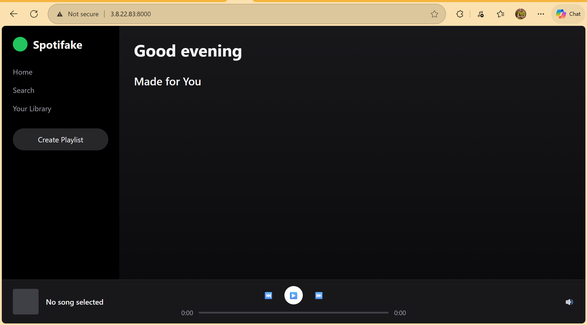

# Spotifake - Flask Music App with Full AWS CI/CD Pipeline


A responsive, Spotify-inspired music web app built with Flask, deployed automatically to AWS EC2 using a complete CI/CD pipeline (GitHub → AWS CodePipeline → CodeBuild → CodeDeploy).

Live Demo: http://3.8.22.83:8000  
*(Temporary public IP — may change on redeploy; check latest pipeline run for updated DNS/IP)*

 

## Features

- Clean, dark-mode Spotify-like UI (HTML + Tailwind CSS via CDN)
- Mock song list & player (static .mp3 files)
- Responsive design (mobile + desktop)
- Full CI/CD pipeline on AWS:
  - Automatic build & test on push
  - Deploy to EC2 with zero-downtime (via CodeDeploy hooks)
- Dockerized local development (Dockerfile + docker-compose.yml)

## Tech Stack

- **Backend**: Flask (Python 3.11)
- **Frontend**: HTML + Tailwind CSS (CDN) + vanilla JS
- **CI/CD**: AWS CodePipeline + CodeBuild + CodeDeploy
- **Deployment**: AWS EC2 (Amazon Linux 2023)
- **Local Dev**: Docker + docker-compose
- **WSGI Server (prod)**: Gunicorn

## Architecture Overview
GitHub (main branch)
↓ (push / pull request)
AWS CodePipeline
↓
AWS CodeBuild ──► (install deps, validate)
↓
AWS CodeDeploy ──► (copy files to EC2, run hooks)
↓
EC2 Instance (t3.micro)
└─► /var/www/spotifake
└─► gunicorn → app:create_app() → port 8000


## CI/CD Pipeline Details

- **Source**: GitHub (Version 2 connector)
- **Build**: AWS CodeBuild (uses `buildspec.yml` – installs deps)
- **Deploy**: AWS CodeDeploy (uses `appspec.yml` + hooks)
  - BeforeInstall: install dependencies
  - ApplicationStart: restart gunicorn server
- **Deployment Group**: Single EC2 instance (tagged `Name=spotifake-ec2`)

## Local Development

1. Clone the repo

   ```bash
   git clone https://github.com/Oluwa-feranmi/spotifake-CICD-portfolio.git
   cd spotifake-CICD-portfolio
    ```
   
2. Run with Docker (recommended)
   ```bash
   docker compose up --build
    ```
   Open: http://localhost:5000
Or run directly (without Docker)
```bash
python -m venv venv
source venv/bin/activate  # or venv\Scripts\activate on Windows
pip install -r requirements.txt
flask run
```

Deployment on AWS (Manual Setup Reference)
This project uses a full AWS CI/CD pipeline:

EC2 instance (Amazon Linux 2023, t3.micro)
CodeDeploy agent installed
IAM role attached (AWSCodeDeployRole + EC2 permissions)
CodePipeline triggered on push to main

For full setup instructions (if someone wants to replicate):

Launch EC2 → install CodeDeploy agent
Create IAM role → attach to EC2
Create CodeDeploy Application & Deployment Group
Create CodePipeline → GitHub source → CodeBuild → CodeDeploy target

(Full CloudFormation template coming soon as future improvement)
Future Improvements

Add CloudFormation template for one-click AWS infrastructure provisioning
Migrate to ECS/Fargate (containerized production)
Add automated tests (pytest) in CodeBuild
Add nginx reverse proxy on EC2 → serve on port 80
Add GitHub Actions alternative pipeline
Implement real user auth & database (PostgreSQL/RDS)
Add monitoring (CloudWatch) & logging

License
MIT License – feel free to fork, modify, and use for learning.

Made with ❤️ by Oluwaferanmi
GitHub: @Oluwa-feranmi
